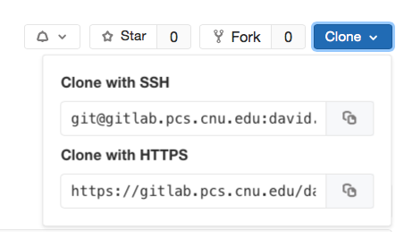
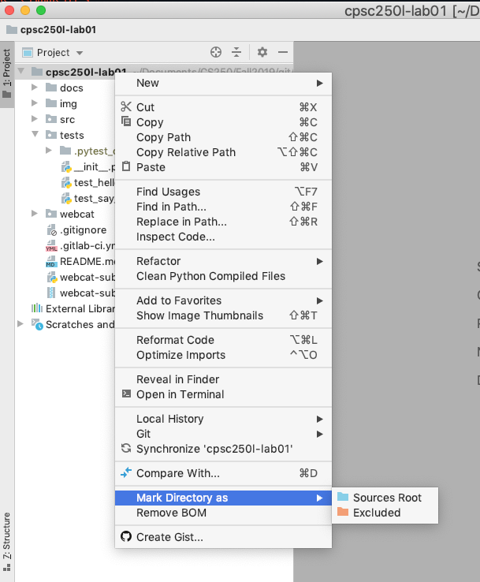
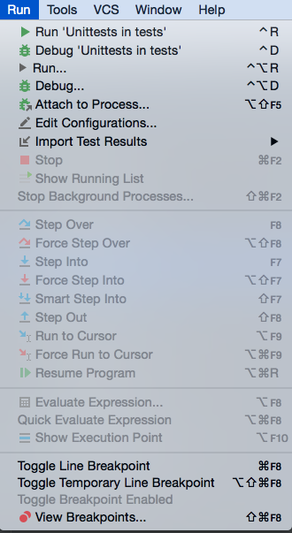
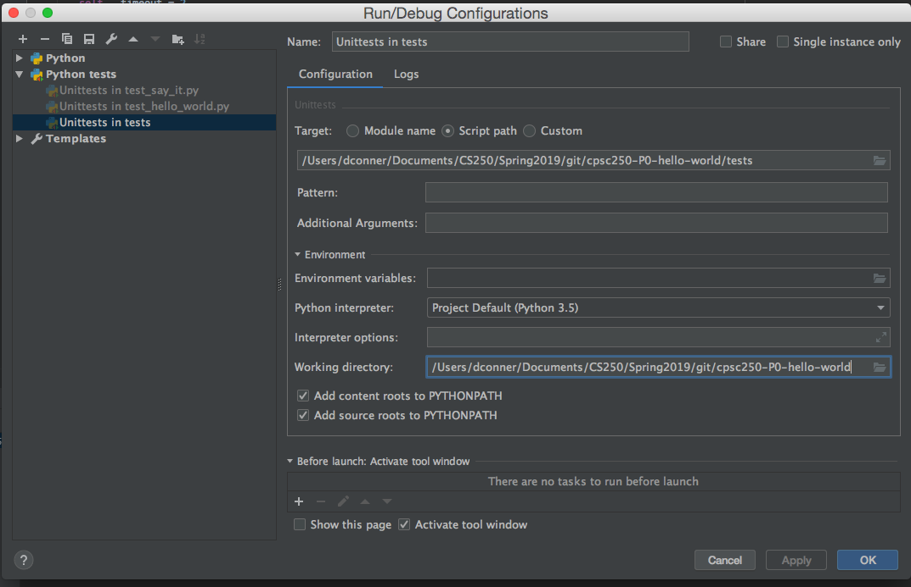

# Git-based Source Code Management and Workflow

This provides an overview of the workflow used for all AI projects this semester.  
> NOTE: This overview borrows from CPSC 250, so the images are from that class.

Learning these tools is part of your professional development, and is required for this course; you are expected to master this workflow.

For setup directions for your personal machine, see [Toolchain Setup](./toolchain_setup.md).
> NOTE: You are not required to use any particular editor or IDE.
> Any common text editor is sufficient for this work, but we have provided
> directions for PyCharm.

This assumes that you have `Git` or `GitBash` installed on your computer, *and*
that you are familiar with moving around your folder structure via command line.
If not, look it up and then see your instructor immediately if you have questions.

****
GitLab Setup
====

We have created a personal Gitlab group for you to use in this class following the `firstname.lastname.yy-ai-semesterYear` convention.  
Your lecture instructor is a member of this group, and can view all of your projects in this group.  
You are required to use this group for *ALL* assignments in the course.


Projects in AI will have common structure.
```
AI-<project ID>
|-source files (only some of which you will modify)
|-test_cases  (provided unit test files that you should NOT modify)
|-docs (optional folder for instructions and documentation)
```

Only modify the files that you are directed to modify!
 **do NOT modify the autograder or test_cases**

****
Setting up the project
====

Fork this repository into your personal group (with name of the form `firstname.lastname.yy-ai-semesterYear`).
After the fork completes, you will be at a repository in that group.
Check the URL for your group name to verify.

Once the fork is
done, select the `Clone` dropdown menu, and click the double file button to right of URL (web) address under `Clone with HTTPS` as shown in



Clicking the icon copies the entire address into the computer *clipboard* memory.
Open up a GitBash shell, `cd` into your desired folder (e.g. `~/Documents/AI`)
Use `pwd` to verify that you are in the correct directory.

> NOTE: This assumes GitBash is installed.  See the tool chain setup directions for installing the necessary software on your personal machine.

> NOTE `cd ~` will take you to your home folder in a bash terminal.

Before we begin using git commands in our terminal, lets first define the four fundamental commands of git. These are:

* `git clone <url>` - The git clone command takes a URL (either internet or local path) and clones or copies all of the files in the git repository to a new folder in the current working directory.

* `git add <file>` - The git add command takes a file or files and prepares them for the next git commit (explained next). We use this command to tell git which files that we have changed and want to add to take a snapshot of. You can visualize this process as git taking the file or files and putting them into an open box that is being prepped to be stored or sent somewhere. Generally as developers we want to add all of the files that we have changed, so it is common to use the command `git add *` to tell git to add all of the changed files to the prepped box.

* `git commit -m "<your commit message>"` - The git commit command takes all of the added files (from the `git add` command) and stores a snapshot of the current code base with the new changes. We use this command to save a snapshot of the code at this current time. Imagine a word document you have been writing for your English class, where instead of your paper being overwritten with the latest stuff you've typed, its a running series of saves of your text from every time you've hit the save button. You can visualize this step as taking the box from the `git add` and sealing it, keeping a perfect copy of the code at that point in time. We use this command so we have a snapshot history of our code as the code develops.
As a short cut, you can combine  `git add` and `git commit` for previously tracked files by using `git commit -am <commit message>`.  This automatically adds *all* modified files, and commits them.

  > Note: If you fail to use the `- m` option, git will open a default editor for you to type your commit message.  The editor varies by machine, but the default uses a *vim*-like interface that requires you to `esc-w-q` to write and quit the editor.  Use this `-m` option and type your message to avoid this complexity.  See your instructor if you get confused by the editor.

* `git push <repository> <branch>` - The git push command takes all of the commits only the local machine and *pushes* them to the repository and branch specified. It will be most common in this class that you will want to push your code to the remote repository on GitLab, so the command to do that is `git push origin master`. The *origin* stands for the repository you originally cloned from (your forked GitLab repository) and the *master* stands for the branch your working on. We will most likely be working on the master branch of our projects.

 > NOTE: For our lab set up, you can just `git push` which defaults to `git push origin master`.  For more complicated branching and remote setups, you should get in the habit of specifying what branch and where you are pushing it to.

Git needs to know who to give credit to when you make a commit; therefore, we need to set our Git *credentials*.  From the GitBash shell, type:
```
git config --global user.name "Full Name"
git config --global user.email "first.last.yy@cnu.edu"
```
replacing `Full Name` and `first.last.yy` with your personal info.

**NOTE: Pay attention to the quote marks around the text.**

  > NOTE: You will need to set these credentials every time you log into the
  > `pcse_user` account on a lab machine.  You only need to do this
  > once on your personal machine, unless you are switching partners
  > during a pair programming exercise.

On Lab Windows machines, git will use the built in Windows `Credential Manager`.  If you mis-type your password, you need to hit the Windows start button and type "cred" and the credential manager should pop up.  Click on it, find the gitlab setup, and "remove" to reset your password.

On Mac machines, the `osxkeychain` can be used.  Google is your friend to help set up on personal machine.

For Linux machines, add
```
git config --global credential.helper "cache --timeout=1800"
```
The `credential.helper cache` saves you from repeatedly needing to type your password for multiple *pushes* to the remote. The 1800 is seconds, which corresponds to a half hour.  Be sure to log out from your machines after you are finished coding and pushing your commits to GitLab.

After configuring your git user information, we are ready to clone our project.

From your designated work folder, e.g. `~/Documents/AI`, type  `git clone ` followed by a SPACE and *PASTE* the URL of your forked repository.
Different machines have different commands for `PASTE`; most often `Ctrl-v` (`Command-v` on Mac), or right click and select `Paste` from menu, works.

Before pressing enter, ensure that *your* group name is in that URL.   
If it is, press enter.

> NOTE: A common error is for students to forget to *fork* and clone the project from the student distribution group.
> If this happens all is not lost, you can `git remote add mine <URL>`.  This adds an additional Git remote called `mine` in addition to the default `origin`.
 Just remember to substitute `mine` where you see `origin` in the below commands.  Fork first and avoid this complexity!


You will be prompted to enter your Gitlab credentials.

If the clone fails, *read the error message carefully* and try again.
* If the Gitlab remote is unreachable on lab machines, you may need to reboot the lab laptop.
* On Windows machines, you may need to reset the Credential Manager if your login credentials changed or were entered incorrectly.  
> NOTE: To reset credentials on Windows, hit Windows button, and type `Creden` and you should see the `Credential Manager` application pop up.  Select it, select `Windows Credentials` and remove the credential associated with Git.


If it fails to clone after 3 tries, immediately
ask your instructor for assistance.


Once the clone succeeds, `cd` into the cloned directory
(e.g. `~/Documents/AI/AI_P0_Tutorial`).
Use `pwd` to determine the full path to this repo, and use `ls -altr` to view the contents of the folder.

 > NOTE: A common error is to forget to `cd` *into* the cloned project folder.
 > Git commands will not work until you are *inside* the project folder!

** Add requested information to your form to show your progress.**


****
PyCharm
====

> NOTE: You may choose any editor or IDE for your work in AI.

PyCharm is an *Integrated Development Environment* (IDE) for Python.  

Start the PyCharm IDE; the main page will start at the project selection menu.

Select `Open Project` and browse to the folder where you just cloned the repo.

> NOTE: Always `Open` the cloned repo folder.  
> Do NOT copy files around because you are editing in a different folder than your git repo.
> Do NOT create a `New` project; always `Open` in AI class.

The Run configuration must set the *Sources Root* folder to the *project Root* .

Do this by right clicking on the project name (e.g. `AI_P0_Tutorial` in this case), and select
`Mark Directory as` and `Sources Root` as shown in



If you do this at the beginning all tests should work correctly.

> NOTE: To set an individual files Run Configuration,
> from the main PyCharm menu, you can select `Run` and then `Edit Configurations` as shown in

>.

> Then edit the `Working Directory` at the bottom of the `Run/Debug Configurations`
> dialog to remove the `tests` directory so that the `Working directory` points to
> the main repo directory as shown in  

>, and select `OK`.

> NOTE: The Edu edition of PyCharm requires jumping through some hoops to
> expose the `Run` menu required to set the Working directory.  
> Using the `Community Edition` simplifies our life.

We are now ready to start coding.


After debugging and completing any bit of incremental progress, open a (GitBash) terminal, change to the project folder,
and verify the changed file:
```
git status
```
 > NOTE: If this gives an error, likely you are not inside the cloned project folder.  Use `pwd` to confirm, and `cd AI<TAB>` (using TAB completion) or `cd AI_P0_Tutorial` to get into the proper cloned folder.


View the changes:
```
git diff
```

Doing the `status` and `diff` checks is optional, but is helpful to verify that you are making changes in the correct folder.

Commit the changes to the local repository:
```
git commit -am "coded something useful"
```
This commits *a*ll changes to tracked files, and adds the *m*essage in quotes.
This `commit` command records your changes to your *LOCAL* repository on your current machine.

> NOTE: At this level, for the love of all that is good in this world, please use
> meaningful commit messages and not just `asdf` or `more code` or `I hate this project`.

Commit frequently.

Push your committed changes from your local repo to the remote repository on our PCSE Gitlab server.
```
git push origin master
```
The `push` command records your *commits* from your local repo to the remote server.

The remote server is named "origin" by default, and "master" is the default branch name.  
For now, we will stick with these default branch names.
For us, a simple `git push` is normally sufficient to do what you want.


Be sure to make at least one commit and one push *EVERY* time you work on coding; **if you aren't committing and pushing, then you aren't working on code in AI.**
If it is not on GitLab, it didn't happen!

 >  NOTE: Verify commit made to Gitlab by clicking on the project name
 > in the Gitlab window, and making sure you see your commit message!


Again, click on the Gitlab project name to return to refresh main project page, and verify your commit is there.

****
GitLab Continuous Integration
====

Unlike CPSC 250 we are NOT using Continuous Integration or WebCAT.
I will just run your autograder as needed.  
You should run the autograder on your own machine to test.

### Git Notes

* If you do your work on different machines, you will need to get in the habit of doing a `git pull` at the start of every session.

> When you first clone a project this is not necessary, but once you are set up on different machines, you need to `git pull` to get your local repo up to date *BEFORE* making changes.
> Otherwise, you will not be able to push to GitLab. If you `git pull` after making changes, you may get *merge conflicts* that must be cleaned up.
> See your instructor for assistance if this happens to you.
